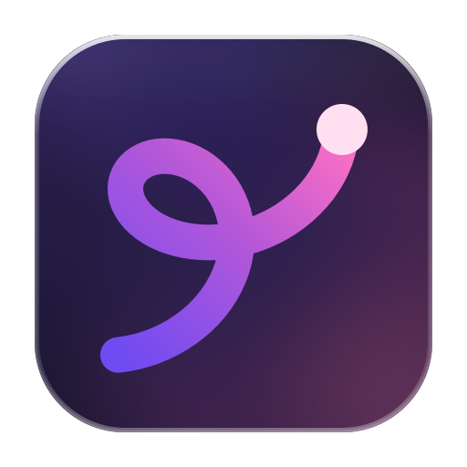

<p align="center">
  
</p>

<h1 align="center">gnat — notion-agent-tracker</h1>

<p align="center">A macOS app for tracking project work in Notion, executed by Claude Code agents.</p>

**gnat** is the native macOS app. You plan a project as milestones and slices
(small units of work), launch Claude Code agents on them, review what they hand
back in a diff, and open and merge the pull request — all from one window. It
is a thin app over the `nat` command line: gnat carries no Notion, tmux or
GitHub logic of its own and shells out to `nat <command> --json` for every read
and write, so what you see is always what `nat` sees.

Three pieces share one tracker:

- **gnat** — the macOS app; the way most people use this.
- **`nat` CLI** — the headless commands. Agents run as fresh `claude` sessions
  in tmux and reach the tracker only through them (`nat start-slice`,
  `nat complete-slice`), and gnat drives the same commands. `nat help` is the
  reference for every command and flag.
- **`nat` TUI** — running `nat` with no subcommand opens the terminal board.
  It is still maintained and keeps up with the CLI, for when you live in a
  terminal.

**Notion** is the source of truth: a Project DB contains project pages; each
project page holds its own Slices DB — milestones are an option list on the
Slices DB's own Milestone column, not a database of their own — plus free-form
project info in the page body. A project can also be *local*, with its plan in
a SQLite file and no Notion workspace behind it.

## Install gnat

Download the latest `gnat-<version>.dmg` from the
[GitHub Releases](https://github.com/craigmjohnston/nat/releases) page, open it
and drag gnat to Applications. Every merge to `main` publishes a signed,
notarized release, and gnat updates itself through Sparkle: it checks for new
releases in the background and offers to install them, so the dmg is only
needed once. The app bundles a universal `nat`; the CLI and TUI below are
optional extras.

gnat needs, on the machine's own install (none are bundled):

- `tmux` and the `claude` CLI — agents run in detached tmux sessions
- `gh`, logged in — for pull requests
- Notion's official CLI, `ntn` (`curl -fsSL https://ntn.dev | bash`), logged in
  with `ntn login`, for Notion-backed projects. The tracker reads its Notion
  token from that CLI rather than storing one of its own, so no integration or
  personal access token is needed — and because the token is workspace-scoped,
  there is no per-page ••• → Connections step. Local projects need none of it.

macOS 15 or later. To build the app from source, see `macos/README.md`.

## Install the CLI and TUI

Go 1.25.x is required:

```sh
ntn login                # once, to authorise the CLI against your workspace
go install github.com/craigmjohnston/nat@latest
nat                      # first run launches the onboarding wizard
```

The repo is private, so the module proxy cannot fetch it. Configure the Go
toolchain to go straight to GitHub over SSH, once per machine:

```sh
go env -w GOPRIVATE=github.com/craigmjohnston/*
git config --global url."git@github.com:".insteadOf "https://github.com/"
```

To build from a clone instead: `make build && ./nat`.

## The CLI

Given a subcommand, `nat` runs it and exits rather than opening the board,
printing to the terminal it was typed in. Run `nat help` for the full command
list and flags — it is the source of truth, and this file does not duplicate
it. Most commands take `--json` for structured output, which is what gnat and
agents parse. In outline:

- **Plan and read:** `info`, `slice-show`, `slice-status`, `slice-add`,
  `slice-edit`, `slice-move`, `slice-depends`, `milestone-*`, `plan-apply`.
- **Agent lifecycle:** `next-slice`, `start-slice`, `complete-slice`,
  `release-slice`, `slice-launch`, `agent-send`, `agent-interrupt`,
  `agent-kill`, `status`.
- **Review and merge:** `slice-diff`, `slice-approve`, `pr-view`, `pr-comment`,
  `pr-merge`, `pr-status`.
- **Projects, sessions and setup:** `project-create`, `session-*`,
  `workshop-launch`, `config-show`, `config-set`, `setup`, `paths`, `usage`.

Every project-scoped command requires `--project <page ID>`; there is no active
project fallback, since the board's own project can change while an agent works.
Run one without it to be told the projects this machine tracks.

```sh
nat info --project <ID>          # conventions, milestones and slices as markdown
nat info --project <ID> --json   # the same, structured
```

## The terminal board

The TUI runs in the terminal you start it in, and hosts itself in nothing: the
board draws its own status band and shows an agent in a box of its own beside
it. Started from inside a tmux session of your own it behaves exactly the same.

tmux is still needed for the agents — each one runs in a detached session, which
is what lets it outlive the board and be shown again later — so `nat` checks for
it on startup and says how to install it if it is missing. The headless commands
launch nothing and need none of it.

### Keeping the board current

The board does not need restarting to notice a change. A write made through a
`nat` command — an agent claiming or closing out a slice — shows within a
second. A change made in Notion itself is picked up by a background poll, every
30 seconds by default; `r` refetches at once. A poll is skipped while a form,
a prompt or a write is in flight, so nothing lands on top of what you are
typing, and resumes on the next one. A poll that fails leaves the plan on the
board as it was and says so on the status line.

To change the interval, add `poll_seconds` to
`~/.config/notion-agent-tracker/config.json`:

```json
{
  "poll_seconds": 120
}
```

Anything outside 5–3600 is treated as a typo and the default is used instead.

### Which Claude Code an agent runs as

Agents are launched with whatever model and effort your own Claude Code is
configured for. To say otherwise, add `slice_agent` and `workshop_agent` to
`~/.config/notion-agent-tracker/config.json`:

```json
{
  "workshop_agent": { "model": "sonnet", "effort": "low" },
  "slice_agent": { "model": "opus", "effort": "high" }
}
```

They are two settings because the two jobs are not the same size: workshopping
a plan (`w` and `W`) is conversation, and often wants a lighter model than the
agent that goes and writes the code (`l`). Either half of either pair may be
left out, and what is left out is left to Claude Code — the values are its own
`--model` and `--effort` flags, so an alias (`sonnet`, `opus`) or a full model
name works, and the effort levels are `low`, `medium`, `high`, `xhigh` and
`max`.

Both are prefilled defaults, not fixed: the planning form and the launch
options (`l`, then "configure & launch") show the pair and let you change it
for that one launch, leaving the config as it is.

### Watching an agent

`t` on a slice with a running agent shows that agent in a pane beside the board;
`t` again sends it back to a session of its own. The board keeps the keyboard
while the agent runs next to it, and the mouse — reported to nat only while an
agent is on show, so your own selection and scrollback are otherwise left
alone — moves between the two:
click the agent to type at it, click the board to come back.

The agent's share of the window defaults to 65%. To change it, add
`agent_split_percent` to `~/.config/notion-agent-tracker/config.json`:

```json
{
  "agent_split_percent": 75
}
```

Anything outside 10–90 is treated as a typo and the default is used instead.

`T` is the way out of the split: it hands the whole terminal to the agent's
session, and detaching with `ctrl-b d` comes back to the board.

## Skills

`/queue-work` (plan work into the tracker), `/queue-project` (turn a
workshopped plan into a whole new tracked project) and `/next-slice` (pick up
and complete the next slice) come with the binary. `nat setup` installs them
into `~/.claude/skills`, which makes them available in any repo:

```sh
nat setup
```

Run it again after upgrading: each skill is reported as created, updated or
unchanged, so an install left behind by an older binary is one command away from
current. Nothing in `~/.claude/skills` other than the tracker's own skills is
read or written — and a skill directory that is a symlink, which is how a
checkout of this repo works on the skills in place, is left alone and said so.

## Status

Being dogfooded on its own Notion tracker.
