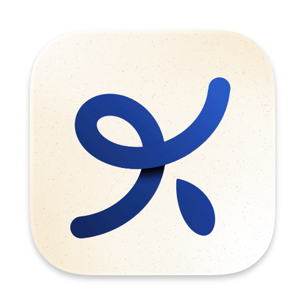

<p align="center">
  
</p>

<h1 align="center">gnat</h1>

<p align="center">Run several Claude Code agents on one project, each on its own task, and keep track of all of it from one window.</p>

Breaking a project into small, well-described tasks is what makes coding
agents reliable. Running more than one of those agents at a time is what
makes them fast. Doing both by hand means a pile of terminals, a pile of
branches, and no clear picture of what is done, what is running, and what is
waiting on you.

gnat is a macOS app for exactly that. You describe a project as milestones
of tasks. Each task gets its own Claude Code agent, working on its own branch
in its own checkout. The app shows what every agent is doing, lets you read
what each one hands back as a diff, and opens and merges the pull request —
without leaving the window.

## How it works

**Plan.** A project is a repository plus a plan: milestones in order, each
holding tasks. A task is one brief — a few paragraphs saying what to change
and how to know it is done — sized for a single agent session. You can write
the plan yourself, or open a workshop: a planning agent reads the repo and
your request, talks it through with you, and proposes milestones and tasks
you can accept or send back. Tasks can depend on each other, and a task stays
blocked until everything it depends on is done.

**Launch.** Launching a task starts a fresh Claude Code session for it, in a
detached tmux session, on a git worktree and branch of its own. The agent is
handed the task's brief, the project's conventions, and a set of commands for
reporting back. Launch as many tasks as you like at once; each runs
independently. You pick the model and effort per launch, with defaults you
set once.

**Watch.** Every running agent is listed across all your projects. Select one
to see its terminal, embedded in the app. Type at it, send it a message,
interrupt it, or end it. A task's history — handed back, sent back,
relaunched, blocked, and so on — is kept on the task itself as a log.

**Review.** When an agent finishes it hands the branch back for review, with a
summary and a draft pull-request description. The app shows the diff, by file
or by commit. Comment on lines and send the comments back, and the agent picks
up where it left off and hands back again. Where the project has a cheap way
to render what changed — a gallery story, a screenshot script — the agent
hands those images in too. If the agent noticed work it did not do, it files
follow-ups for you to queue as new tasks, fold into the current one, or drop.
Approving opens the pull request.

**Merge.** Merge from the app, or on GitHub. Either way the task is Done only
once its work is on `main`; a pull request still open with review comments
can be relaunched as a fix session that reads the comments and addresses
them. Merging removes the task's worktree.

Beyond planned tasks there is room for the one-off: a scratch project for
tasks with no plan, and ad hoc sessions — a bare agent on a repo with no
brief at all, still tracked, still reviewable, still merged from the app.

## Where the plan lives

By default a project's plan is a local SQLite file on your Mac. No account,
no workspace, nothing to sign up for.

A project can instead be kept in a Notion workspace — a project page holding
a tasks database — so the plan can be read and edited from Notion as well as
from the app. A local project can be mirrored into Notion later. For Notion
the app reads its token from Notion's own CLI, `ntn`, and stores no
credential of its own.

Tasks can also hang off an external tracker. A task-source plugin owns the
containers (a Shortcut story, say) and gnat owns the tasks filed under them.
A Shortcut plugin is published with every release; plugins are installed and
set up from Settings ▸ Sources.

## Install

Download the latest `gnat-<version>.dmg` from
[GitHub Releases](https://github.com/craigmjohnston/nat/releases), open it,
and drag gnat to Applications. The app keeps itself up to date: every merge
to `main` publishes a signed, notarized release, and gnat offers new ones as
they appear.

macOS 15 or later. The app bundles its own command-line core; it needs these
on the machine, none of which are bundled:

- `tmux` and the `claude` CLI — agents run in detached tmux sessions
- `gh`, logged in — for pull requests
- `ntn`, Notion's official CLI, logged in — only for Notion-backed
  projects (`curl -fsSL https://ntn.dev | bash`, then `ntn login`)

To build the app from source, see [`macos/README.md`](macos/README.md).

## Your first project

1. Open gnat and make a new project, pointing it at a repository.
2. Describe the work in the brief and start a workshop. The planning agent
   proposes milestones and tasks; accept them, or keep workshopping.
3. Launch a task. Watch its agent in the terminal pane, or launch a few more.
4. When one hands back, read the diff. Send comments back, or approve to open
   the pull request.
5. Merge. The task is Done and its worktree is gone.

## The command line

The app is a thin layer over a command-line tool, `nat`. Every read and write
the app makes goes through `nat <command> --json`, and the agents report back
through the same commands — which is why an agent needs no Notion or tracker
access of its own, and why what you see in the app is always what the agents
see.

Because of that, everything in the app can be done from a terminal or a
script, and `nat` with no subcommand opens a terminal board with the same
plan on it. `nat help` is the reference for every command and flag.

```sh
go install github.com/craigmjohnston/nat@latest   # Go 1.25 or later
nat project-create "My project" --local --repo .  # a project with a local plan
nat info --project <ID>                           # its milestones and tasks
nat                                               # the terminal board
```

Every project-scoped command takes `--project <ID>`. There is no "current
project": the app's selection can change while an agent is working, so
nothing is allowed to depend on it.

A naming note: the commands were written when tasks were called slices, and
still say so — `slice-add`, `next-slice`, `complete-slice`. Read `slice` as
task.

### Skills

Three Claude Code skills come with the binary and work in any repository
once installed with `nat setup`:

- `/queue-work` — turn a description of work into milestones and tasks in an
  existing project, after you approve the proposal.
- `/queue-project` — turn a workshopped plan into a whole new project.
- `/next-slice` — claim the next available task, do it, and hand the branch
  back for review: the same loop a launched agent runs, for a Claude Code
  session you started yourself.

Run `nat setup` again after upgrading; it reports each skill as created,
updated or unchanged.

### Configuration

Config lives at `~/.config/notion-agent-tracker/config.json` (`nat paths`
prints the location). The app's Settings window covers what most people
change; `nat config-show` and `nat config-set` do the same from a terminal.
The setting worth knowing about up front is which Claude Code an agent runs
as. Planning and coding are different-sized jobs, so there are two defaults,
each overridable per launch:

```json
{
  "workshop_agent": { "model": "sonnet", "effort": "low" },
  "slice_agent": { "model": "opus", "effort": "high" }
}
```

The values are Claude Code's own `--model` and `--effort` flags; leave either
half out to use whatever your Claude Code is configured for.

The terminal board has a few settings of its own — see
[`docs/tui.md`](docs/tui.md).

## Status

Early, and in daily use: gnat is developed on its own tracker, by the agents
it launches.
